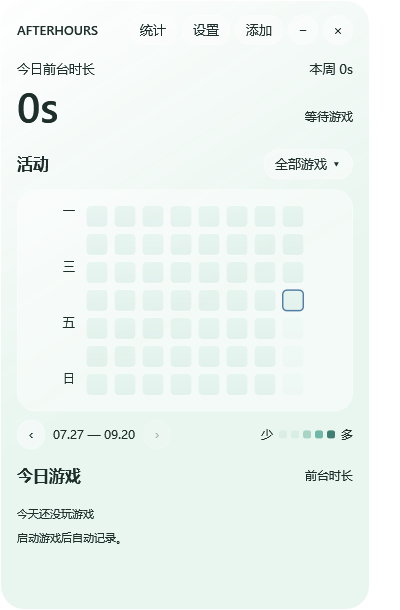
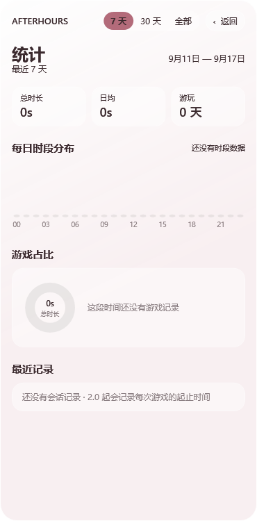

# Afterhours 2.0.1

> **启动方法：下载并完整解压后，双击 `Afterhours启动.vbs`。请不要直接在 ZIP 压缩包内运行。**

一款轻量的 Windows 桌面游戏时间看板。它在本机统计游戏的前台时长与运行时长，并用活动热力图和每日游戏卡片展示。

从 1.0 升级或查看本次变化，请阅读 [`1.0-数据迁移教程.md`](1.0-数据迁移教程.md)、[`2.0.1-更新公告.md`](2.0.1-更新公告.md) 与 [`更新日志.md`](更新日志.md)。

| 主界面 | 统计页面 |
| --- | --- |
|  |  |

## 功能

- **自动统计游戏时间**：每秒读取同一 Windows 会话中的进程，分别累计游戏处于前台和后台运行的时间。
- **系统托盘**：启动脚本保持隐藏，托盘菜单提供“退出 Afterhours”，不占任务栏。
- **专属托盘图标**：月牙与四格活动图形用于标识 Afterhours，在浅色和深色任务栏上均保持清晰。
- **Steam 自动识别**：启动时读取本机 Steam 安装清单，按游戏目录识别游戏进程；Steam 客户端、启动器、崩溃报告和常见反作弊辅助程序不会计入。
- **常见游戏预设**：内置剑网三、守望先锋和三角洲行动的常见进程规则。
- **特殊游戏回退识别**：内置 Apex Legends 和无限暖暖的实际游戏进程规则，在反作弊导致路径不可读时仍可识别。
- **手动添加游戏**：运行游戏后从进程列表选择一次并命名，以后自动统计，适用于其他平台和特殊启动方式。
- **活动热力图**：以 8 周为一页显示每日前台时长，可前后翻页。
- **按游戏筛选**：点击今日游戏卡片或游戏菜单，可查看单款游戏的专属热力图；清除筛选后恢复全部游戏汇总。
- **悬停查看当日明细**：热力格显示日期、前台时长、运行时长及各游戏明细。
- **今日游戏可视化**：游戏卡片显示前台时长和比例条，悬停可查看运行与后台时长。
- **可视化统计页面**：支持 7 天、30 天和全部记录筛选，用 24 小时时段分布、游戏占比环图、常玩时段与精确会话记录展示游戏时间。
- **桌面层显示**：看板位于普通应用和游戏窗口下方，不置顶、不抢焦点；按 `Win + D` 可查看。
- **透明玻璃界面**：主窗口、菜单和明细卡都只在圆角内部绘制半透明渐变，圆角外保持完全透明。
- **可调整窗口**：默认尺寸比 1.0 更紧凑，可拖动右下角改变大小。
- **主题与深色模式**：提供极地雾、极光薄荷、烟粉三种主题，主题同步作用于热力图、标签和进度条。
- **可选开机启动**：默认关闭，可在设置中为当前 Windows 用户开启或关闭。
- **手动游戏管理**：可以删除错误或多余的手动进程规则，不影响内置和 Steam 自动规则。
- **独立演示模式**：内置 56 天合成示例历史，不写入真实统计数据；切回实测即可恢复真实看板。
- **本地持久化**：数据每 5 秒原子保存并保留备份，正常退出时再次保存。
- **锁屏和休眠保护**：锁屏、休眠、桌面不可读或采样间断超过 5 秒时不累计该间隔。

## 运行

1. 下载并完整解压发布包，不要直接在 ZIP 中运行。
2. 双击 `Afterhours启动.vbs`。这是正常启动入口，不会显示命令行窗口。
3. 按 `Win + D` 回到桌面，在右上角查看看板。

环境要求：64 位 Windows、系统自带的 Windows PowerShell 5.1 和 WPF。不需要安装 Python、Node，也不需要登录 Steam 账号。

如果启动失败，双击 `诊断启动.cmd` 查看错误；也可以在解压目录打开终端运行：

```powershell
powershell.exe -NoProfile -ExecutionPolicy Bypass -STA -File .\Live.ps1
```

错误信息也会写入 `data/startup-error.log`。

## 数据与隐私

Afterhours 完全在本机运行，不联网，不读取键盘鼠标输入、游戏内容或窗口标题。程序只读取：

- 当前前台进程及同一用户会话中的运行进程；
- Steam 注册表安装位置和本地游戏清单，用于识别游戏；
- 用户手动添加的游戏进程名。

首次运行后会在程序目录生成 `data` 文件夹：

- `activity.json`：按日期和游戏保存累计秒数；
- `games.json`：手动添加的游戏规则；
- `preferences.json`：主题和深色模式设置；
- `runtime.json`：当前进程和窗口运行状态；
- `sessions.json`：2.0 开始记录的前台游戏会话及起止时间；
- `startup-error.log`：仅在启动失败时生成。

发布包不包含开发者的 `data`、个人游戏记录、本机安装路径或日志。转发自己运行过的副本前，请删除自己的 `data` 文件夹。

启用开机启动时，程序会在当前用户的 `HKCU\Software\Microsoft\Windows\CurrentVersion\Run` 中写入启动命令，其中包含用户选择的软件目录路径；关闭开机启动会移除该项。

## 统计口径与限制

- 只统计看板运行期间的活动，不能回填过去的游戏时间。
- 精确会话时间轴从 2.0 开始记录；1.0 的按日汇总无法反推出过去的具体起止时间。

### 从 1.0 升级

2.0.1 不提供长期数据导入按钮。若要保留 1.0 历史，请在第一次启动 2.0.1 前阅读包内的 `1.0-数据迁移教程.md`，关闭两个版本后复制指定数据文件。1.0 没有保存具体会话起止时间，所以历史每日累计可以保留，时间轴只能从 2.0.1 开始记录。
- 前台时长代表游戏进程连续处于前台的采样时间，可能包含挂机。
- 新安装 Steam 游戏后需重启看板以刷新清单。
- 特殊启动器、受保护程序或特殊目录结构可能需要手动添加。
- 采样统计存在约一个采样周期的保守误差。
- 当前版本是 PowerShell/WPF 预览版，尚未签名，也未完成多机兼容性测试。

## 项目文件

- `Live.ps1`：主界面、交互、筛选、主题和数据调度。
- `Tracker.ps1`：进程采样、Steam 扫描、计时和保存。
- `Silver.xaml`：WPF 界面。
- `DayCard.ps1`：热力图悬停明细卡。
- `Demo.ps1`：独立示例历史。
- `DesktopLayer.cs`：桌面层级、无焦点窗口、毛玻璃和原生圆角。
- `Afterhours启动.vbs`：正常启动入口，无控制台窗口。
- `诊断启动.cmd` / `Launcher.ps1`：启动失败时显示错误并写入日志。
- `Afterhours.ico`：包含 16 至 256 像素的 Windows 多尺寸托盘图标。

## 卸载

先在设置中关闭开机启动，退出看板，然后删除整个文件夹。
